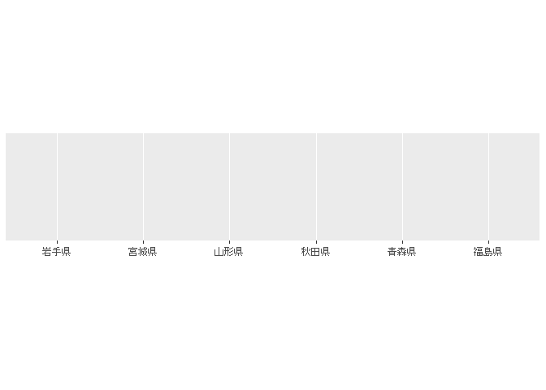
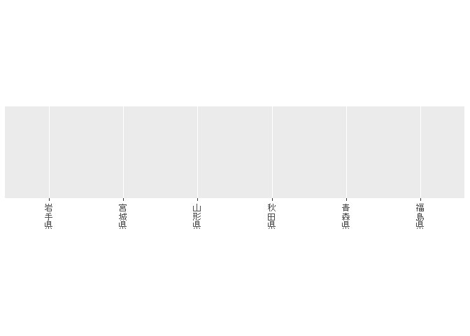
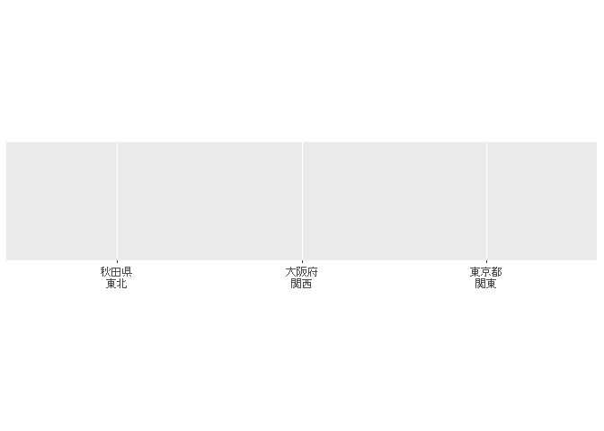
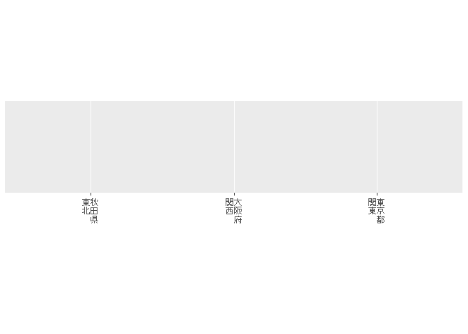

<!-- README.md is generated from README.Rmd. Please edit that file -->

# infun

<!-- badges: start -->
<!-- badges: end -->

This is a collection of R utilities functions for me, but maybe also for
you.

Functions may be added, specifications of functions may change or become
obsolete, and names may change without notice.

## Installation

install the development version install from GitHub:

``` r
install.packages("remotes")
remotes::install_github("indenkun/infun", build_vignettes = TRUE)
```

## Example

load library.

``` r
library(infun)
```

Make a sample data for README (`example.data`).

``` r
example.data <- data.frame(value1 = 1:10,
                           value2 = c(1:3, "strings", 5:10),
                           value3 = c(1:3, "strings", 5:10),
                           value4 = 11:20)
```

### `find.not.numeric.value()`

This function is used to find the where in the vector there are values
that cannot be converted to numbers.

If you specify a column from the dataframe with `[]`, it behaves in the
same way.

If you input a dataframe that contains multiple columns, it will return
the location of the column that contains the value that cannot be
converted to a number, if specified.

The fourth data in value2 of `example.data` will be a string.
`find.not.numeric.value()` will show where all the data in the vector is
located if there is a value that will be forced to NA when converted to
numeric type by `as.numeric()`. If there is no value to be converted, NA
is returned.

``` r
find.not.numeric.value(example.data$value1)
#> [1] NA
find.not.numeric.value(example.data$value2)
#> [1] 4
find.not.numeric.value(example.data[1])
#> [1] NA
find.not.numeric.value(example.data[2])
#> [1] 4
find.not.numeric.value(example.data)
#> [1] 2 3
```

### `find.same.value.col()`

This function is used to find a column consisting of the same value in a
data frame.

If you run `same.value.col()` on `example.data`, you will see that the
second and third columns of the sample data all have the same value.

The result is returned in a list format.

``` r
find.same.value.col(example.data)
#> [[1]]
#> NULL
#> 
#> [[2]]
#> [1] 3
#> 
#> [[3]]
#> [1] 2
#> 
#> [[4]]
#> NULL
```

`unique_col()` is a function to remove duplicate columns in a data
frame, the column version of `{base}`’s `unique()`.

``` r
unique_col(example.data)
#>    value1  value2 value4
#> 1       1       1     11
#> 2       2       2     12
#> 3       3       3     13
#> 4       4 strings     14
#> 5       5       5     15
#> 6       6       6     16
#> 7       7       7     17
#> 8       8       8     18
#> 9       9       9     19
#> 10     10      10     20
```

### `find.not.integer.value()`

This function is used to find a non-integer value in a vector.

The input value can be of any type, but it must be a vector of numbers
only. If a string or other value is entered, a warning message will be
displayed and `NA` will be returned. If you get a warning message that a
non-numeric value is entered, try `find.not.numeric.value()` to find the
non-numeric value.

If you input a dataframe that contains multiple columns, it will return
the location of the column that contains the value that non-integer, if
specified.

``` r
example.data.integer <- data.frame(Item1 = 1:10,
                                   Item2 = c(1:5, 6.5, 7.5, 8:10),
                                   Item3 = c(1:6, "strings", 8:10))
```

Returns the location as a number if the value is not an integer. If no
non-integer values are entered in a vector consisting of numbers, NA
will be returned.

If `"logical"` is specified in `where`, a vector of logical type will be
returned.

``` r
find.not.integer.value(example.data.integer$Item1)
#> [1] NA
find.not.integer.value(example.data.integer[2])
#> [1] 6 7
find.not.integer.value(example.data.integer[1:2])
#> [1] 2
find.not.integer.value(example.data.integer$Item3)
#> Warning in find.not.integer.value(example.data.integer$Item3): there are any
#> values that not numeric value.
#> [1] NA
```

### `find.not.as.Date.value()`

This function is used to find the where in the vector there are values
that cannot be converted to `Date` using `as.Date()` in `{base}`.

``` r
example.data.Date <- data.frame(Date1 = c("2021-7-28", "2021-08-08", "2021-08-24", "2021-09-05"),
                                Date2 = c("2021-7-28", "NOTDATE", "NOTDATE", "2021-09-05"),
                                Date3 = c("210728", "21/08/08", "21/Aug-24", "21sep5"))

find.not.as.Date.value(example.data.Date$Date1)
#> [1] NA
find.not.as.Date.value(example.data.Date$Date2)
#> [1] 2 3
find.not.as.Date.value(example.data.Date$Date3)
#> [1] 1 3 4
```

### `find.not.as_date.value()`

This function is used to find the where in the vector there are values
that cannot be converted to `Date` using `as_date()` in `{lubridate}`.

There is a slight difference between the values that can be converted to
Date by `{lubridate}`’s `as_date()` and those that can be converted by
`{base}`’s `as.Date()`.

``` r
find.not.as_date.value(example.data.Date$Date1)
#> [1] NA
find.not.as_date.value(example.data.Date$Date2)
#> [1] 2 3
# as_date() converts even relatively fuzzy forms if they can be changed to a date type, while as.Date() operates relatively more strictly.
find.not.as_date.value(example.data.Date$Date3)
#> [1] NA
```

### `add.str()`

Combine all the items in a specific column of a data frame with any
string of characters in the original data frame. The converted column
will be a string because it contains strings such as ALL.

You need to specify any column as `key` with the column name.

``` r
example.data.add.all <- add.str(example.data, "value1")
head(example.data.add.all, 20)
#>    value1  value2  value3 value4
#> 1       1       1       1     11
#> 2       2       2       2     12
#> 3       3       3       3     13
#> 4       4 strings strings     14
#> 5       5       5       5     15
#> 6       6       6       6     16
#> 7       7       7       7     17
#> 8       8       8       8     18
#> 9       9       9       9     19
#> 10     10      10      10     20
#> 11    ALL       1       1     11
#> 12    ALL       2       2     12
#> 13    ALL       3       3     13
#> 14    ALL strings strings     14
#> 15    ALL       5       5     15
#> 16    ALL       6       6     16
#> 17    ALL       7       7     17
#> 18    ALL       8       8     18
#> 19    ALL       9       9     19
#> 20    ALL      10      10     20
```

### `random.Date()`

`random.Date()` is a function that randomly creates a vector of dates at
a specified sample size between a specified date and a date.

``` r
random.Date(from = "2021/1/1", to = "2021/4/1", size = 10)
#>  [1] "2021-01-21" "2021-03-17" "2021-03-09" "2021-02-20" "2021-02-24"
#>  [6] "2021-02-22" "2021-02-06" "2021-03-24" "2021-02-03" "2021-03-11"
```

### `age.cal()`

`age.cal()` is a function that calculates the number of years (age by
default), months, and days from a specified date to a specified date.

``` r
age.cal(from = c("2000/1/1", "2010/1/1"), to = "2021/4/1")
#> [1] 21 11
```

### `tableone.rename.*()`

These functions are used to change the headline character in the item
name of a table created with `{tableone}`’s to any character.

`tableone.rename.overall()` is used to change the “Overall” character in
the item name of a table created with `{tableone}`’s `CreateTableOne()`
to any character.

``` r
# This is the code to create a sample table in `{tableone}`.
library(tableone)

iris.table <- CreateTableOne(data = iris)
iris.table
#>                           
#>                            Overall     
#>   n                         150        
#>   Sepal.Length (mean (SD)) 5.84 (0.83) 
#>   Sepal.Width (mean (SD))  3.06 (0.44) 
#>   Petal.Length (mean (SD)) 3.76 (1.77) 
#>   Petal.Width (mean (SD))  1.20 (0.76) 
#>   Species (%)                          
#>      setosa                  50 (33.3) 
#>      versicolor              50 (33.3) 
#>      virginica               50 (33.3)

# Rename "Overall" to "ALL".
tableone.rename.overall(iris.table, rename.str = "ALL")
#>                           
#>                            ALL         
#>   n                         150        
#>   Sepal.Length (mean (SD)) 5.84 (0.83) 
#>   Sepal.Width (mean (SD))  3.06 (0.44) 
#>   Petal.Length (mean (SD)) 3.76 (1.77) 
#>   Petal.Width (mean (SD))  1.20 (0.76) 
#>   Species (%)                          
#>      setosa                  50 (33.3) 
#>      versicolor              50 (33.3) 
#>      virginica               50 (33.3)
```

`tableone.rename.headline()` is a function that change any heading
(including Overall) to any character by setting the table heading as an
formula before and after the change.

``` r
# This is the code to create a sample table in `{tableone}`.
library(tableone)
library(survival)
data(pbc)

varsToFactor <- c("status","trt","ascites","hepato","spiders","edema","stage")
pbc[varsToFactor] <- lapply(pbc[varsToFactor], factor)
vars <- c("time","status","age","sex","ascites","hepato",
          "spiders","edema","bili","chol","albumin",
          "copper","alk.phos","ast","trig","platelet",
          "protime","stage")
tableOne <- CreateTableOne(vars = vars, strata = c("trt"), data = pbc, addOverall = TRUE)
tableOne
#>                       Stratified by trt
#>                        Overall           1                 2                
#>   n                        418               158               154          
#>   time (mean (SD))     1917.78 (1104.67) 2015.62 (1094.12) 1996.86 (1155.93)
#>   status (%)                                                                
#>      0                     232 (55.5)         83 (52.5)         85 (55.2)   
#>      1                      25 ( 6.0)         10 ( 6.3)          9 ( 5.8)   
#>      2                     161 (38.5)         65 (41.1)         60 (39.0)   
#>   age (mean (SD))        50.74 (10.45)     51.42 (11.01)     48.58 (9.96)   
#>   sex = f (%)              374 (89.5)        137 (86.7)        139 (90.3)   
#>   ascites = 1 (%)           24 ( 7.7)         14 ( 8.9)         10 ( 6.5)   
#>   hepato = 1 (%)           160 (51.3)         73 (46.2)         87 (56.5)   
#>   spiders = 1 (%)           90 (28.8)         45 (28.5)         45 (29.2)   
#>   edema (%)                                                                 
#>      0                     354 (84.7)        132 (83.5)        131 (85.1)   
#>      0.5                    44 (10.5)         16 (10.1)         13 ( 8.4)   
#>      1                      20 ( 4.8)         10 ( 6.3)         10 ( 6.5)   
#>   bili (mean (SD))        3.22 (4.41)       2.87 (3.63)       3.65 (5.28)   
#>   chol (mean (SD))      369.51 (231.94)   365.01 (209.54)   373.88 (252.48) 
#>   albumin (mean (SD))     3.50 (0.42)       3.52 (0.44)       3.52 (0.40)   
#>   copper (mean (SD))     97.65 (85.61)     97.64 (90.59)     97.65 (80.49)  
#>   alk.phos (mean (SD)) 1982.66 (2140.39) 2021.30 (2183.44) 1943.01 (2101.69)
#>   ast (mean (SD))       122.56 (56.70)    120.21 (54.52)    124.97 (58.93)  
#>   trig (mean (SD))      124.70 (65.15)    124.14 (71.54)    125.25 (58.52)  
#>   platelet (mean (SD))  257.02 (98.33)    258.75 (100.32)   265.20 (90.73)  
#>   protime (mean (SD))    10.73 (1.02)      10.65 (0.85)      10.80 (1.14)   
#>   stage (%)                                                                 
#>      1                      21 ( 5.1)         12 ( 7.6)          4 ( 2.6)   
#>      2                      92 (22.3)         35 (22.2)         32 (20.8)   
#>      3                     155 (37.6)         56 (35.4)         64 (41.6)   
#>      4                     144 (35.0)         55 (34.8)         54 (35.1)   
#>                       Stratified by trt
#>                        p      test
#>   n                               
#>   time (mean (SD))      0.883     
#>   status (%)            0.894     
#>      0                            
#>      1                            
#>      2                            
#>   age (mean (SD))       0.018     
#>   sex = f (%)           0.421     
#>   ascites = 1 (%)       0.567     
#>   hepato = 1 (%)        0.088     
#>   spiders = 1 (%)       0.985     
#>   edema (%)             0.877     
#>      0                            
#>      0.5                          
#>      1                            
#>   bili (mean (SD))      0.131     
#>   chol (mean (SD))      0.748     
#>   albumin (mean (SD))   0.874     
#>   copper (mean (SD))    0.999     
#>   alk.phos (mean (SD))  0.747     
#>   ast (mean (SD))       0.460     
#>   trig (mean (SD))      0.886     
#>   platelet (mean (SD))  0.555     
#>   protime (mean (SD))   0.197     
#>   stage (%)             0.201     
#>      1                            
#>      2                            
#>      3                            
#>      4

# Rename headline name "1" to "D-penicillmain", "2" to "placebo".
# Names that contain hyphens will be evaluated as negative in the formula, so they must be enclosed in quotation marks.
tableone.rename.headline(tableOne, rename.headline = list(1 ~ "D-penicillmain", 2 ~ placebo))
#>                       Stratified by trt
#>                        Overall           D-penicillmain    placebo          
#>   n                        418               158               154          
#>   time (mean (SD))     1917.78 (1104.67) 2015.62 (1094.12) 1996.86 (1155.93)
#>   status (%)                                                                
#>      0                     232 (55.5)         83 (52.5)         85 (55.2)   
#>      1                      25 ( 6.0)         10 ( 6.3)          9 ( 5.8)   
#>      2                     161 (38.5)         65 (41.1)         60 (39.0)   
#>   age (mean (SD))        50.74 (10.45)     51.42 (11.01)     48.58 (9.96)   
#>   sex = f (%)              374 (89.5)        137 (86.7)        139 (90.3)   
#>   ascites = 1 (%)           24 ( 7.7)         14 ( 8.9)         10 ( 6.5)   
#>   hepato = 1 (%)           160 (51.3)         73 (46.2)         87 (56.5)   
#>   spiders = 1 (%)           90 (28.8)         45 (28.5)         45 (29.2)   
#>   edema (%)                                                                 
#>      0                     354 (84.7)        132 (83.5)        131 (85.1)   
#>      0.5                    44 (10.5)         16 (10.1)         13 ( 8.4)   
#>      1                      20 ( 4.8)         10 ( 6.3)         10 ( 6.5)   
#>   bili (mean (SD))        3.22 (4.41)       2.87 (3.63)       3.65 (5.28)   
#>   chol (mean (SD))      369.51 (231.94)   365.01 (209.54)   373.88 (252.48) 
#>   albumin (mean (SD))     3.50 (0.42)       3.52 (0.44)       3.52 (0.40)   
#>   copper (mean (SD))     97.65 (85.61)     97.64 (90.59)     97.65 (80.49)  
#>   alk.phos (mean (SD)) 1982.66 (2140.39) 2021.30 (2183.44) 1943.01 (2101.69)
#>   ast (mean (SD))       122.56 (56.70)    120.21 (54.52)    124.97 (58.93)  
#>   trig (mean (SD))      124.70 (65.15)    124.14 (71.54)    125.25 (58.52)  
#>   platelet (mean (SD))  257.02 (98.33)    258.75 (100.32)   265.20 (90.73)  
#>   protime (mean (SD))    10.73 (1.02)      10.65 (0.85)      10.80 (1.14)   
#>   stage (%)                                                                 
#>      1                      21 ( 5.1)         12 ( 7.6)          4 ( 2.6)   
#>      2                      92 (22.3)         35 (22.2)         32 (20.8)   
#>      3                     155 (37.6)         56 (35.4)         64 (41.6)   
#>      4                     144 (35.0)         55 (34.8)         54 (35.1)   
#>                       Stratified by trt
#>                        p      test
#>   n                               
#>   time (mean (SD))      0.883     
#>   status (%)            0.894     
#>      0                            
#>      1                            
#>      2                            
#>   age (mean (SD))       0.018     
#>   sex = f (%)           0.421     
#>   ascites = 1 (%)       0.567     
#>   hepato = 1 (%)        0.088     
#>   spiders = 1 (%)       0.985     
#>   edema (%)             0.877     
#>      0                            
#>      0.5                          
#>      1                            
#>   bili (mean (SD))      0.131     
#>   chol (mean (SD))      0.748     
#>   albumin (mean (SD))   0.874     
#>   copper (mean (SD))    0.999     
#>   alk.phos (mean (SD))  0.747     
#>   ast (mean (SD))       0.460     
#>   trig (mean (SD))      0.886     
#>   platelet (mean (SD))  0.555     
#>   protime (mean (SD))   0.197     
#>   stage (%)             0.201     
#>      1                            
#>      2                            
#>      3                            
#>      4
```

### `seq_geometric()`

This function is used to generate a sequence of equal ratios, also known
as a geometric sequence.

By specifying the first term in `from`, the last term or the closest
value to the last term in `to`, and the common ratio in `by.rate`, you
can obtain an geometric sequence of “first term \* common ratio ^ n”
from “from” to the closest value to “to”.

``` r
seq_geometric(from = 1, to = 128, by.ratio = 2)
#> [1]   1   2   4   8  16  32  64 128
```

### `Rtools.pacman.package.*()`

These are functions to search for packages that can be installed by
Rtools’ pacman. In short, it is a wrapper for some of the functions of
pacman in Rtools.

Cannot be used except in a Windows environment where Rtools40 or later
is installed.

You may not be able to use the functions in Rtools42(on R 4.2.x). Please
configure Rtools42 before executing the function.

`Rtools.pacman.package.list()` is a function that outputs a list of
packages that can be installed by Rtools pacman from repository. By
specifying arguments, you can extract only those packages that are
already installed, or only those that are yet uninstalled.

``` r
package.list <- Rtools.pacman.package.list()
# It's too long, so show part of it in head()
head(package.list)
```

`Rtools.pacman.package.list()` is a function that displays a list of
packages that can be installed by pacman in Rtools from repository with
the specified arguments in the string. If no matching package is found,
return NA.

``` r
package.list.curl <- Rtools.pacman.package.find("curl")
# It's too long, so show part of it in head()
head(package.list.curl)
```

### `scale.data.frame()`

`scale.data.frame()` is generic function whose default method centers
and/or scales the columns of a numeric in data frame. The non-numeric
values in the data frame will remain unchanged.

In short, it is a generic function of `{base}` `cale()`.

It is a generic function of `scale()`, so call it with `scale()` when
`{infun}` library is loaded. If the object is a data frame, this will
work by itself.

If you want to call it explicitly, use `infun:::scale.data.frame()`.

If you want to explicitly use the `{base}` `scale()` after loading
`{infun}` as a library, you can use it in `scale.default()`.

``` r
z.iris <- scale(iris)
# It's too long, so show part of it in head()
head(z.iris)
#>   Sepal.Length Sepal.Width Petal.Length Petal.Width Species
#> 1   -0.8976739  1.01560199    -1.335752   -1.311052  setosa
#> 2   -1.1392005 -0.13153881    -1.335752   -1.311052  setosa
#> 3   -1.3807271  0.32731751    -1.392399   -1.311052  setosa
#> 4   -1.5014904  0.09788935    -1.279104   -1.311052  setosa
#> 5   -1.0184372  1.24503015    -1.335752   -1.311052  setosa
#> 6   -0.5353840  1.93331463    -1.165809   -1.048667  setosa
```

### `save_gtsummary()`

This function is used to output the table created by the gtsummary
package in PowerPoint or Word, or as an image file. It just wraps
`{gtsummary}`’s `as_flex_table()` and `{flextalbe}`’s `save_as*()`
functions.

Supported filename extensions: .pptx, .docx, .png, .pdf, .jpg.

``` r
library(gtsummary)
library(tidyverse)

# Sample code for gtsummary
tbl_summary_ex1 <-
  trial %>%
  select(age, grade, response) %>%
  tbl_summary()
  
# Output the table created by gtsummary to PowerPoint(.pptx).
tbl_summary_ex1 %>% 
  save_gtsummary(path = "table.pptx")
```

### `round_any_*()`

`round_any()` is used to round a vector made of numbers to an
approximation of a sequence of numbers with arbitrary equidifferences.

If the value matches an arbitrary isoperimetric sequence, the value will
be output as is.

If the `type` argument is `ceiling`, it will round to the upper side of
the nearest value, and if the `type` argument is `floor`, it will round
to the lower side.

``` r
example.vector <- seq(0, 1, 0.1)
example.vector
#>  [1] 0.0 0.1 0.2 0.3 0.4 0.5 0.6 0.7 0.8 0.9 1.0

round_any(example.vector, by = 0.25, type = "ceiling")
#>  [1] 0.00 0.25 0.25 0.50 0.50 0.50 0.75 0.75 1.00 1.00 1.00

round_any(example.vector, by = 0.25, type = "floor")
#>  [1] 0.00 0.00 0.00 0.25 0.25 0.50 0.50 0.50 0.75 0.75 1.00
```

`round_any_ceiling()` is a simplified version of `round_any()`, which
outputs the result with the argument of `type` fixed to `ceiling` and
`origin` fixed to `0`. `round_any_floor()` is a simplified version of
`round_any()`, where the `type` argument is fixed to `floor` and the
`origin` is fixed to `0`. `round_any_*` is faster than `round_any()` in
most cases, because the internal processing is done as a vector.

**However, in rare cases, `round_any_*()` may not be possible to obtain
accurate values because of R’s internal floating point arithmetic.
`round_any()` creates a sequence of numbers and compares them, so it
gives accurate rounding results.**

``` r
round_any_ceiling(example.vector, 0.25)
#>  [1] 0.00 0.25 0.25 0.50 0.50 0.50 0.75 0.75 1.00 1.00 1.00

round_any_floor(example.vector, 0.25)
#>  [1] 0.00 0.00 0.00 0.25 0.25 0.50 0.50 0.50 0.75 0.75 1.00
```

### `rand_moji()`

Function to create a random Japanese (Kanji or Hiragana) string. Only
the range of regular kanji is supported.

It is also compatible and reproducible for `set.seed()`.

``` r
rand_moji(length = 3, size = 3, moji = "kanji")
#> [1] "缶販微" "症凸噴" "侍沖忌"

rand_moji(length = 3, size = 3, moji = "hiragana")
#> [1] "にうぁ" "もんゐ" "えヴり"
```

It is a random string, so it does not reflect the normal rules of
Japanese. In the case of hiragana, characters that do not normally
appear at the beginning of a string, such as Sutegana and “n”, will also
appear at the beginning.

Katakana strings are not supported and should be converted using
functions such as `stringi::stri_trans_general()` in the `{stringi}`
package.

``` r
hiragana.moji <- rand_moji(length = 3, size = 3, moji = "hiragana")
hiragana.moji
#> [1] "つざそ" "がせど" "せこへ"
katakana.moji <- stringi::stri_trans_general(hiragana.moji, "hiragana-katakana")
katakana.moji
#> [1] "ツザソ" "ガセド" "セコヘ"
```

### `str_remove_sandwich()`

Delete a string of characters sandwiched between specific characters.

The specified string must be a single character, and the first and last
characters of the string must be different.

``` r
str_remove_sandwich("西馬音内《にしもない》は雄勝郡羽後町《おがちぐんうごまち》です。", start_pattern = "《", end_pattern = "》")
#> [1] "西馬音内は雄勝郡羽後町です。"
```

Please escape characters that need to be escaped, such as `()`.

``` r
str_remove_sandwich("dplyr (≥ 0.8.3), arabic2kansuji (≥ 0.1.0)", "\\(", "\\)")
#> [1] "dplyr , arabic2kansuji "
```

### `subset_interchange_col()`

For any two columns specified in the data frame (say column A and B), if
the combination of column A and B is the same even if they are swapped,
it will return it as a data frame or a row number.

For example, if column A has “TOM” and “BOB”, and the same respective
row in column B has “BOB” and “TOM”, the row will be extracted as
interchangeable.

Also, when there is a row with the same value in column A and B, it is
also determined to be interchangeable and extracted.

``` r
example.interchange <- data.frame(X = c("TOM", "BOB", "JOHN", "POP"),
                                  Y = c("BOB", "TOM", "BEE", "TOO"),
                                  Z = seq(10, 40, by = 10))
subset_interchange_col(example.interchange, "X", "Y")
#>     X   Y  Z
#> 1 TOM BOB 10
#> 2 BOB TOM 20
subset_interchange_col(example.interchange, "X", "Y", out.put = "num")
#> [1] 1 2
```

### `list2data.frame_*()`

Function to convert a list into a dataframe.

For list of different lengths, the data frame is constructed according
to the longest list, and for short lists, the missing places are filled
with NA according to the long list.

`list2data.frame_cbind()` makes each element of the list a column.

`list2data.frame_rbind()` makes each element of the list a row.

``` r
multi_length_list <- list(A = 1,
                          B = 1:2,
                          C = 1:3,
                          D = c(1, NA, 3:4),
                          E = c(1, NA))
list2data.frame_cbind(multi_length_list)
#>    A  B  C  D  E
#> 1  1  1  1  1  1
#> 2 NA  2  2 NA NA
#> 3 NA NA  3  3 NA
#> 4 NA NA NA  4 NA
list2data.frame_rbind(multi_length_list)
#>   X1 X2 X3 X4
#> A  1 NA NA NA
#> B  1  2 NA NA
#> C  1  2  3 NA
#> D  1 NA  3  4
#> E  1 NA NA NA
```

Of course, lists of the same length can also be converted to data
frames.

``` r
equal_length_list <- list(a = 1:4,
                          b = 5:8,
                          c = 9:12)
list2data.frame_cbind(equal_length_list)
#>   a b  c
#> 1 1 5  9
#> 2 2 6 10
#> 3 3 7 11
#> 4 4 8 12
list2data.frame_rbind(equal_length_list)
#>   X1 X2 X3 X4
#> a  1  2  3  4
#> b  5  6  7  8
#> c  9 10 11 12
```

### `objcets_length*()`

`objects_length()` returns the length value of the input object as a
vector.

`objects_length_all_equal` returns TRUE if the lengths of all input
objects are equal, and FALSE if any one of them is different.

`objects_length_num_equal` returns TRUE if the length of the input
object is at least one equal to the length specified by .num.

`objects_length_num_equal_quantity` returns the number of input objects
whose length is equal to the length specified by .num. If .quantity is
specified, it will return TRUE if the answer is equal to the specified
number.

``` r
x <- 1:3
y <- 1:6
z <- 1:3
objects_length(x, y, z)
#> [1] 3 6 3
objects_length_all_equal(x, y, z)
#> [1] FALSE
objects_length_num_equal(x, y, z, .num = 6)
#> [1] TRUE
objects_length_num_equal_quantity(x, y, z, .num = 3)
#> [1] 2
objects_length_num_equal_quantity(x, y, z, .num = 3, .quantity = 2)
#> [1] TRUE
```

### `var_()`

`var_()` computes an interval estimate of the population variance of `x`
and a hypothesis test using the given population variance.

The sample variance of the estimate is the unbiased variance computed
with `stats::var()`.

It also calculates the population variance assuming the given value is
the population.

Returns results in the “htest” class.

``` r
var_(iris$Sepal.Length)
#> 
#>  Chi-squared test
#> 
#> data:  iris$Sepal.Length
#> X-squared = Inf, df = 149, p-value < 2.2e-16
#> alternative hypothesis: true population variance is not equal to 0
#> 95 percent confidence interval:
#>  0.5531973 0.8725029
#> sample estimates:
#>     sample_variance population_variance 
#>           0.6856935           0.6811222
```

### label_vertical()

`label_vetical()` is function to convert the axis labels of a ggplot2
format graph to a vertical writing system.

It does not actually realize the vertical writing system, but actually
just changes lines one character at a time.

If horizontal bars are not replaced with vertical bars, unnatural
Japanese notation may result. By default, some horizontal bars are
specified with `vertical_list()` and replaced with vertical bars.

``` r
touhoku <- c("青森県", "秋田県", "岩手県", "山形県", "宮城県", "福島県")
scales::demo_discrete(touhoku)
#> scale_x_discrete()
```



``` r
scales::demo_discrete(touhoku, labels = label_vertical())
#> scale_x_discrete(labels = label_vertical())
```



The function to express line breaks when the text consists only of
Japanese has been provided, but there is a possibility of misalignment
when half-width characters are included or when proportional fonts are
used.

``` r
tiiki <- c("秋田県\n東北", "東京都\n関東", "大阪府\n関西")
scales::demo_discrete(tiiki)
#> scale_x_discrete()
```



``` r
scales::demo_discrete(tiiki, labels = label_vertical(line_feed = "\n"))
#> scale_x_discrete(labels = label_vertical(line_feed = "\n"))
```



### `mode_()` and `mode_data.farme()`

`mode()` is function to calculate the mode and frequency given a vector
or a data frame.

``` r
mode_(iris["Sepal.Length"])
#>   Sepal.Length Freq
#> 1            5   10
```

If multiple columns of data frames are given, the most frequent
combination of combinations and frequencies is computed.

Large data frames cannot be calculated properly.

``` r
mode_(iris[c(1, 5)])
#>   Sepal.Length Species Freq
#> 1            5  setosa    8
#> 2          5.1  setosa    8
```

`mode_data.frame()` calculate the mode frequency for each column of the
data frame.

The result is in the form of a data frame that returns answers in the
form of column name, mode, and frequency. More than one answer may be
returned for a column as the mode may not be uniquely obtained.

``` r
mode_data.frame(iris)
#>       colnames      value Freq
#> 1 Sepal.Length          5   10
#> 2  Sepal.Width          3   26
#> 3 Petal.Length        1.4   13
#> 4 Petal.Length        1.5   13
#> 5  Petal.Width        0.2   29
#> 6      Species     setosa   50
#> 7      Species versicolor   50
#> 8      Species  virginica   50
```

### `dummy_code()`

Given a variable x with n distinct values, create n new dummy coded
variables coded 0/1 for presence (1) or absence (0) of each variable.

This function can be used to create a dummy code by splitting a single
value into multiple values separated by commas or other delimiters by
specifying any delimiter character.

``` r
df_sample <- data.frame(sample = c("a,b", "b", "c", "c,a", "a,b,c"))
dummy_code(df_sample$sample, split = ",")
#>   a b c
#> 1 1 1 0
#> 2 0 1 0
#> 3 0 0 1
#> 4 1 0 1
#> 5 1 1 1
```

### `replace_match()`

Function to replace a value that exactly matches a pattern with a
replacement. Given a vector of equal length for pattern and replacement,
the first value of pattern is interpreted as replacing the first value
of replacement. This means that a large number of patterns and
replacements can be specified in a vector.

``` r
pref_list <- c("あきた", "秋田", "秋田県", "あき田", "秋た", "東京都")
pattern <- c("あきた", "秋田", "あき田", "秋た")
replacement <- c("秋田県", "秋田県", "秋田県", "秋田県")
replace_match(pref_list, pattern = pattern, replacement = replacement)
#> [1] "秋田県" "秋田県" "秋田県" "秋田県" "秋田県" "東京都"
```

If a value is specified for the `nomatch` argument, any value that does
not match the pattern and is not substituted is returned; if `nomatch`
is not specified, the original value is output.

``` r
replace_match(pref_list, pattern = pattern, replacement = replacement, nomatch = NA_character_)
#> [1] "秋田県" "秋田県" NA       "秋田県" "秋田県" NA
replace_match(pref_list, pattern = pattern, replacement = replacement, nomatch = "変換不要")
#> [1] "秋田県"   "秋田県"   "変換不要" "秋田県"   "秋田県"   "変換不要"
```

### `na.omit_select()`

If NA is present in a selected column in the data frame, returns a data
frame with the rows containing NA in that column removed if the default
is the case. If `.retrieve = FALSE` is specified, only rows with NA in
the chosen column are returned.

Multiple columns may be specified as the columns to be selected.

``` r
example_data <- data.frame(value1 = c(1, 2, NA, NA, 10),
                           value2 = c(1, NA, 3:5),
                           value3 = c(NA, 1, 2, NA, 10))
na.omit_select(example_data, value2, value3)
#>   value1 value2 value3
#> 3     NA      3      2
#> 5     10      5     10
na.omit_select(example_data, value2, value3, .retrieve = FALSE)
#>   value1 value2 value3
#> 1      1      1     NA
#> 2      2     NA      1
#> 4     NA      4     NA
```

### `hosmer_test()`

Hosmer-Lemeshow Goodness of Fit (GOF) Test is to check model quality of
logistic regression models.

The Hosmer-Lemeshow Goodness of Fit (GOF) Test is a method for obtaining
statistics by dividing observed and expected values into several
arbitrary subgroups. The method of dividing the observed and expected
values into subgroups is generally based on the quantile of the expected
value, for example, by taking a decile of the expected value. This
method is used in the `hoslem.test()` function of the
`{resouceselection}` package and the `performance_hosmer()` function of
the `{performance}` package.

However, there are several variations on how to divide the subgroups,
and **this function uses a method in which the expected values are
ordered from smallest to largest so that each subgroup has the same
number of samples as possible.**

The division of subgroups when simple is TRUE and when FALSE is
different. See Detail in the documentation for details.

``` r
data("Titanic")
df <- data.frame(Titanic)
df <- data.frame(Class = rep(df$Class, df$Freq),
                 Sex = rep(df$Sex, df$Freq),
                 Age = rep(df$Age, df$Freq),
                 Survived = rep(df$Survived, df$Freq))
model <- glm(Survived ~ . ,data = df, family = binomial())
HL <- hosmer_test(model)
HL
#> 
#>  Hosmer and Lemeshow goodness of fit test
#> 
#> data:  glm(formula = Survived ~ ., family = binomial(), data = df)
#> X-squared = 82.909, df = 8, p-value = 1.268e-14
cbind(HL$observed, HL$expected)
#>               y0_obs y1_obs  y0_expect y1_expect
#> 0.104            387     75 413.970751  48.02925
#> 0.199            154     14 134.615153  33.38485
#> 0.225            670    192 667.619238 194.38076
#> 0.251             35     13  35.944389  12.05561
#> 0.407            118     57 103.768314  71.23169
#> 0.418 - 0.566     89     87  77.995475  98.00452
#> 0.665 - 0.736     13     85  26.219038  71.78096
#> 0.766              3     20   5.380762  17.61924
#> 0.79              17     14   6.496165  24.50383
#> 0.885 - 0.957      4    154  17.990715 140.00929
```

### `readme()`

Access The Package README in a Browser. With the package installed,
access the README of the installed package from CRAN or GitHub with a
browser.

If the package was installed from CRAN, it accesses the CRAN package web
page with the README; if there is no README, an empty web page is
displayed.

If the package was installed from GitHub, the web page of package on the
GitHubis accessed.

``` r
readme("infun")
```

## Imports packages

- `{purrr}`
- `{stats}`
- `{utils}`

## Suggests packages

- `{gtsummary}`
- `{flextable}`
- `{tools}`
- `{lubridate}`
- `{dplyr}`
- `{knitr}`
- `{rmarkdown}`

## License

MIT.

## Notice

- The email address listed in the DESCRIPTION is a dummy. If you have
  any questions, please post them on ISSUE.
